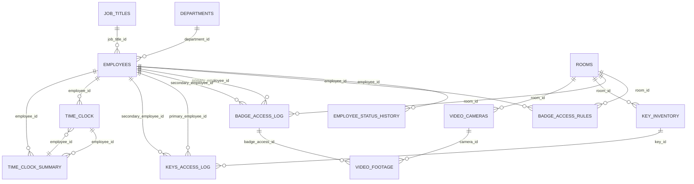

# Security Test Database — User Guide and Relationship Map

This guide is the best starting point for understanding the database. It explains what each table does, which relationships are true identifier-based links, and which relationships are analytical correlations used to detect suspicious activity.

> **Important:** All supplied records are anonymous test data. Some records intentionally do not make sense under normal business rules. Those anomalies should normally be preserved because they are part of the security-analysis test scenarios.

## Table directory

| Table | Plain-English purpose |
|---|---|
| `badge_access_log` | Records physical badge-entry/exit activity, including granted, denied, and detected tailgating events. |
| `badge_access_rules` | Defines which employees may access which rooms and when that authorization is valid. |
| `departments` | Defines organizational departments and their normal building location. |
| `employee_status_history` | Tracks employee status changes such as Active, On Leave, and Terminated. |
| `employees` | Master employee information and links to department and job title. |
| `job_titles` | Defines job titles and broader job categories. |
| `keys_access_log` | Records physical key checkout/return activity and custody. |
| `key_inventory` | Defines physical keys and the rooms those keys serve. |
| `rooms` | Defines secured rooms, building, access level, and dual-custody requirement. |
| `time_clock` | Raw employee IN/OUT clock punches. |
| `time_clock_summary` | Daily work-time summary derived from time-clock activity. |
| `video_cameras` | Defines surveillance cameras and the rooms they monitor. |
| `video_footage` | Indexes stored video and optionally links footage to badge-access events. |

## Entity relationship diagram

## Direct identifier relationships

| Child table | Column | Parent table | Parent column | Meaning |
|---|---|---|---|---|
| `employees` | `department_id` | `departments` | `department_id` | Employee belongs to department. |
| `employees` | `job_title_id` | `job_titles` | `job_title_id` | Employee has job title. |
| `employee_status_history` | `employee_id` | `employees` | `employee_id` | Status row belongs to employee. |
| `badge_access_rules` | `employee_id` | `employees` | `employee_id` | Rule grants access to employee. |
| `badge_access_rules` | `room_id` | `rooms` | `room_id` | Rule applies to room. |
| `badge_access_log` | `room_id` | `rooms` | `room_id` | Badge event occurred at room. |
| `badge_access_log` | `primary_employee_id` | `employees` | `employee_id` | Primary person in badge event. |
| `badge_access_log` | `secondary_employee_id` | `employees` | `employee_id` | Second person in dual-custody event. |
| `key_inventory` | `room_id` | `rooms` | `room_id` | Key serves room. |
| `keys_access_log` | `key_id` | `key_inventory` | `key_id` | Key-use event uses inventory key. |
| `keys_access_log` | `primary_employee_id` | `employees` | `employee_id` | Primary key custodian. |
| `keys_access_log` | `secondary_employee_id` | `employees` | `employee_id` | Second dual-custody participant. |
| `time_clock` | `employee_id` | `employees` | `employee_id` | Punch belongs to employee. |
| `time_clock_summary` | `employee_id` | `employees` | `employee_id` | Daily summary belongs to employee. |
| `video_cameras` | `room_id` | `rooms` | `room_id` | Camera monitors room. |
| `video_footage` | `camera_id` | `video_cameras` | `camera_id` | Footage came from camera. |
| `video_footage` | `badge_access_id` | `badge_access_log` | `badge_access_id` | Optional event footage link. |

## Analytical relationships that are not simple foreign keys

These are especially important for your security-analysis use case:

- **Was the badge event authorized?** Match `badge_access_log.primary_employee_id` and `room_id` to `badge_access_rules.employee_id` and `room_id`, then verify that `access_time` falls within `valid_from` through the **inclusive** `valid_until` date.
- **Was the employee active?** Use `employee_status_history` to determine the employee status effective at the badge/key event date; compare with `employees.termination_date` where relevant.
- **Was the employee on site?** Compare badge/key event timestamps with `time_clock` punches or the daily interval in `time_clock_summary`.
- **Did key and badge activity agree?** Use `keys_access_log.key_id → key_inventory.room_id`, employee IDs, and timestamps to compare key use with room badge activity.
- **Was dual custody satisfied?** If `rooms.dual_custody_required = 1`, evaluate both `primary_employee_id` and `secondary_employee_id` in badge and key activity.
- **Does video evidence agree?** Follow `video_footage.camera_id → video_cameras.room_id` and compare that room and footage time with the linked `badge_access_log` event.
- **Was the employee in an unexpected building?** Compare `departments.location`, `rooms.building`, and `time_clock.location`.

## Confirmed business rules

1. `secondary_employee_id` identifies the second employee participating in **dual custody** in both `badge_access_log` and `keys_access_log`.
2. `employee_status_history.changed_by` is **free text**, not a foreign key. It can contain a system label or an email address.
3. `badge_access_rules.valid_until` is **inclusive**.
4. `badge_access_log.access_result = 'Tailgate'` means a **detected tailgating security incident**.
5. `time_clock_summary.hours_worked` is elapsed time between clock-in and clock-out with **no meal or break deduction**.
6. Suspicious, incomplete, or inconsistent records may be **intentional test anomalies** and should not automatically be repaired.

## Known intentional test examples

- Video footage around the **2026-05-20 19:45** denied room-access event has a badge-event reference that does not line up cleanly with its time/location.
- One key-access record is `Overdue` with no `returned_at` value.
- Employee 8 has a missing OUT punch on **2026-05-20**, producing a `Missing Punch` daily summary.
- Additional authorization, timing, room, custody, or sequencing inconsistencies may also be deliberate.

## Recommended RAG usage

Ingest this guide together with all 13 table-specific Markdown files. The individual files give precise table-level context; this guide helps retrieval answer cross-table questions such as **“Was this employee authorized to enter this room?”**, **“Was dual custody satisfied?”**, or **“Does the video evidence agree with the access log?”**.
